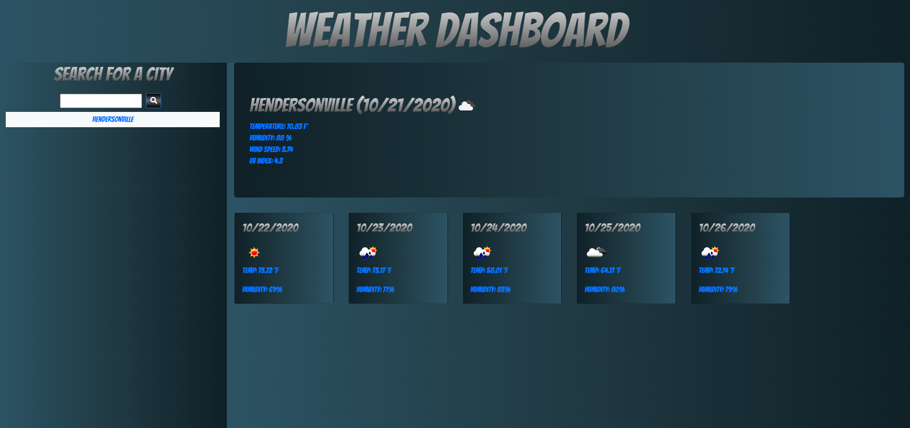

# Weather Dashboard with Bootstrap Gradient Styling
I wanted to refactor one of my class projects from UNC Charlotte and do some cool stuff with it like add font styling and gradient backgrounds. This app uses Open Weather Map Api https://rapidapi.com/community/api/open-weather-map.  I added a css file and figured out how to rename all the components of the app so I could split them out in the css file and start adding gradients to them. I used googlefonts to change the style of the text and added the gradients on the text with css by grabbing the h tags.

## Deployed Site 
https://macparthum.github.io/Gradient_Weather_Dashboard/

## Screenshot of Weather Dashboard

